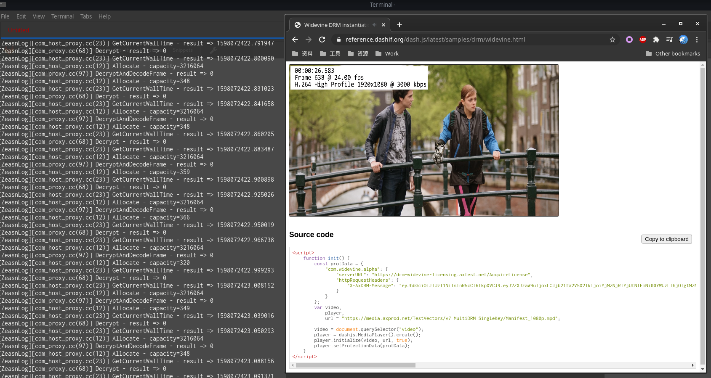

# Chromium CDM proxy

## Introduction

A proxy shared library aims to monitor the data exchange between Chromium browser and WidevineCDM library.

**ONLY works on Linux.**

## Usage

* Build the libproxy for target platform.
* Move original `libwidevinecdm.so` to other path.
* Move/link `libproxy.so` to the path where `libwidevinecdm.so` was at.
* Set environment variable `Z_CDM_LIB` with the full path of original `libwidevinecdm.so`.
* Run Chromium/Chrome browser.

All function call and data exchange will be logged to STDERR, prefixed with `[ZeasnLog]`.

To recover the original Widevine CDM, simply move original `libwidevinecdm.so` back, replacing 
the proxy library.

## Example:

> Assume OS architecture is x64, and Chrome browser is installed at "/opt/google/chrome", then 
> the WidevineCDM library can be found at "/opt/google/chrome/WidevineCdm/_platform_specific/linux_x64".

```
# 1. Move the original library to other path:
cd /opt/google/chrome/WidevineCdm/_platform_specific/linux_x64/
sudo mv libwidevinecdm.so libwidevinecdm-original.so 

# 2. Link libproxy.so to here
sudo ln -s /path/to/libproxy.so libwidevinecdm.so

# 3. Manually quit chrome, or kill all running chrome process:
killall -s 9 chrome

# 4. Run browser with environment variable "Z_CDM_LIB".
export Z_CDM_LIB=/opt/google/chrome/WidevineCdm/_platform_specific/linux_x64/libwidevinecdm-original.so 
/opt/google/chrome/google-chrome

# 5. Open a URL which contains DRM protected video, then check the logging.
```

If everything is OK, you can see logging from the proxy library.

## Screenshot



